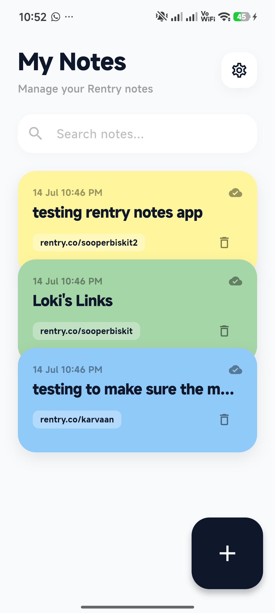
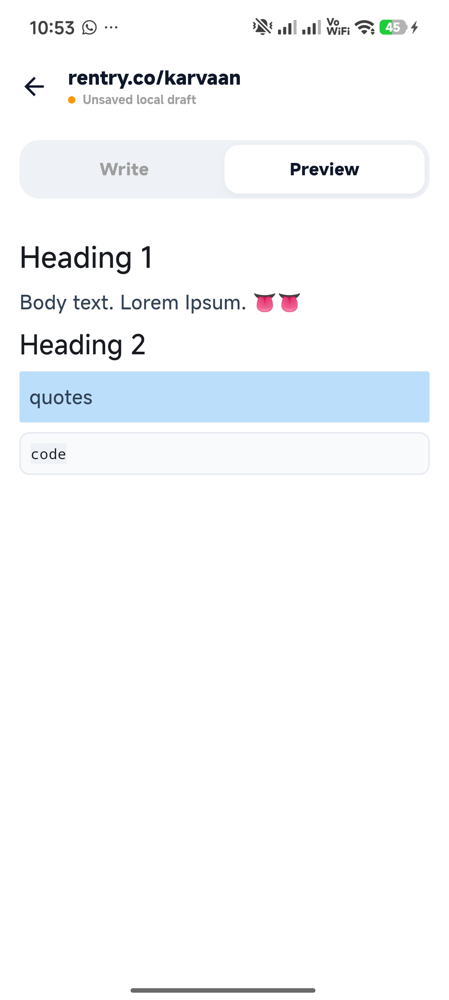

# Rentr
**A minimal Rentry notes manager for android**

[Download it here!](https://github.com/NonStickFryingPan/Rentr/releases/latest)

> **Note:** The APK is unsigned, so you may see a warning when installing because I was too lazy to sign it.

<table>
  <tr>
    <td></td>
    <td></td>
  </tr>
</table>

## About
Rentr is a minimal Rentry notes manager built with Flutter.

## Features
* Offline-first cache with auto-save
* Scrapes notes directly from public edit pages
* Dynamic HTML entity decoding for formatting safety
* Custom auto-fading editor controls

## License
MIT
